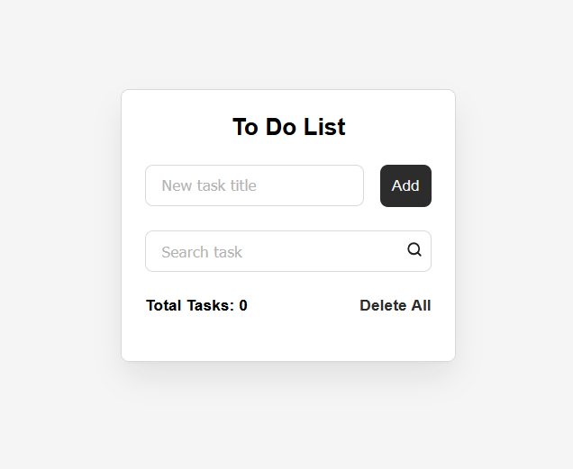

# 📝 ToDo App

A simple and clean Todo List application built with vanilla JavaScript using OOP principles.

## 🖥️ Preview

> Add a screenshot here — take a screenshot of your app and upload it to the repo as `assets/images/preview.png`

```

```

---

## 🛠️ Technologies

- HTML5
- CSS3
- JavaScript (ES6+)
- localStorage

---

## ✨ Features

- ✅ Add new tasks
- 🗑️ Delete tasks
- ☑️ Mark tasks as completed
- 🔍 Search tasks by name
- 💾 Data persistence via localStorage (tasks saved after page reload)

---

## 🏗️ Architecture (OOP)

The project is built with 4 classes following the principle of separation of concerns:

| Class | Responsibility |
|-------|---------------|
| `Task` | Data model for a single task |
| `TaskStorage` | Save and load tasks from localStorage |
| `TaskManager` | Business logic (add, remove, toggle, search) |
| `TodoUI` | DOM manipulation and event handling |

---

## 🚀 Getting Started

1. Clone the repository:
```bash
git clone https://github.com/Kwinxxx/ToDo-js.git
```

2. Open `index.html` in your browser — no build tools required.

---

## 📚 What I Learned

- Building applications using **OOP** in JavaScript
- Separating **business logic** from **UI logic**
- Working with the **DOM** (creating elements, handling events)
- Persisting data with **localStorage**
- Using array methods: `filter()`, `find()`, `map()`, `includes()`

---

## 🔮 Planned Features

- [ ] Edit existing tasks
- [ ] Filter by status (all / active / completed)
- [ ] Task description
- [ ] Due dates for tasks

---

## 👤 Author

**Kwinxxx** — [GitHub](https://github.com/Kwinxxx)
